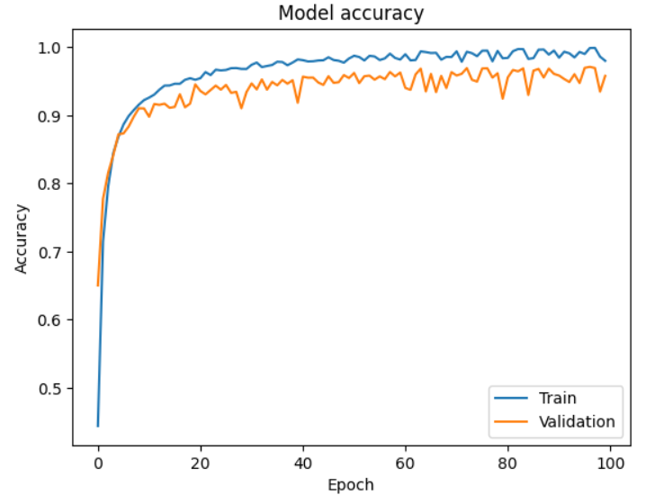
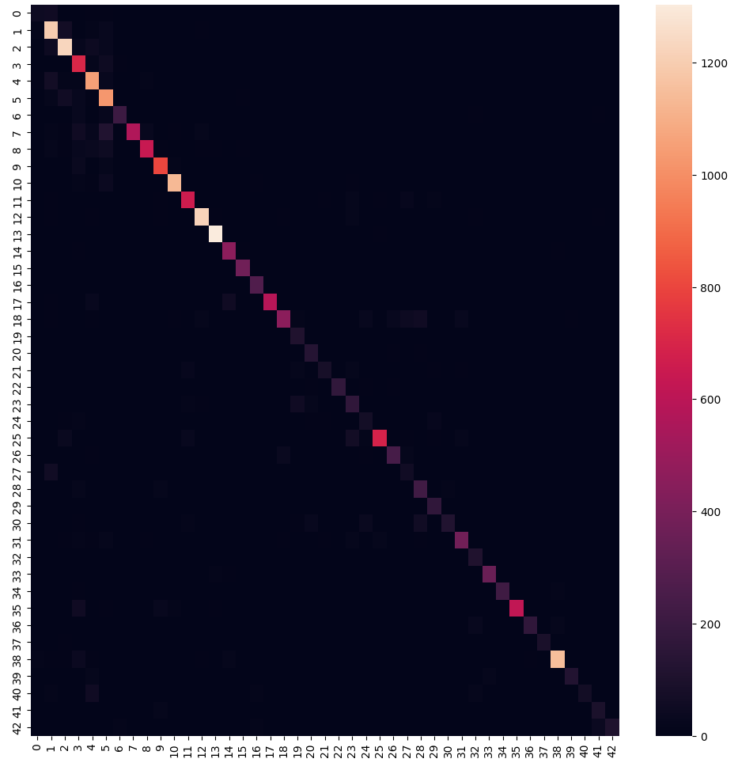

# Abstract 

(copiado do outro)  
Nowadays autonomous driving is a hot topic and
it is becoming increasingly evident that cars will become more
and more automated in the future. To achieve this, it is necessary
that cars can analyze the environment around them and make the
best decisions based on that. One of the most important aspects
of this is the ability to recognize traffic signs. This report shows
our approach to the machine learning GTSRB - German Traffic
Sign Recognition Benchmark challenge. The GTSRB dataset
consists of 43 classes of traffic signs, commonly found on German
roads, and has over 50000 images. In this report, we analyze
how different machine learning models perform in this task and
compare their results. We also analyze the results of the models
and try to understand why some models perform better than
others.

# Introduction

More and more we see an increased interest in automated vehicle driving both in the manufacturers as well as in common citizens wanting to buy such products. The relevance of this study is ... to find a model that most accurately possibly predicts traffic signs, which will help in autonomous driving.
This project consists of classifying images of traffic signs according to one of these 43 labels shown below.

## Why we chose this project

The world of automation in cars is fascinating to us and it's becoming increasingly evident that a car's software is just as critical as its physical and mechanical components. As a result, it's highly probable that many of us may have the opportunity to work in this field in the future. Computer vision and the ability to recognize patterns on the road are fundamental to an autonomous car and machine learning models are a way to solve this need with pretty good results.
As many more people dedicate themselves to this subject of study, quickly and easier it will be to find a robust and very efficient model which will be able to correctly classify traffic signs. Although our contribution may not be worthy as were are just starting in this field and our knowledge is limited, is it always good to be able to try to perform as well as professionals.

# State of the Art

The German Traffic Sign Recognition Benchmark (GTSRB) dataset, was provided by the Real-Time Computer Vision research group at *Institut für Neuroinformatik (INI)*[[1](https://www.ini.rub.de/)], in Germany and was used to held a competition at the International Joint Conference on Neural Networks (IJCNN) in 2011. Along side with the German Traffic Sign Detection Benchmark (GTSDB), ...
The team who won the competition had a total of 99.46% recognition rate with new unseen examples and used the Committee of CNNs method. Through the analysis of their paper[[2](https://www.sciencedirect.com/science/article/abs/pii/S0893608018300054)] ... 
However, latter appear another contestants who achived 99.71% with the method of CNN with 3 Spatial Transformers[[2](https://www.sciencedirect.com/science/article/abs/pii/S0893608018300054)]. They used an architecture with 3 CNN layers and 14,629,801 trainable parameters.
On IEE website, ...
In Kaggle website, entusiasts attempt to find the best model they can get.
"Traffic sign detection is a challenging computer vision task of high industrial relevance."

The paper of papers https://ieeexplore.ieee.org/document/6706807
este daqui: https://paperswithcode.com/dataset/gtsrb 
https://www.sciencedirect.com/science/article/abs/pii/S0893608018300054 

# Data visualization

As said before, we have 43 classes corresponding to a traffic sign. 
We have a folder with 39209 images to train and a folder with 12630 images to test, this makes around 24.36% of the entire dataset to test. 

We have a total of 39209 images to train spread across all 43 classes, however, each class does not have the same amount of samples 

As seen by the graph above, we have a data imbalance.

We picked 30 random samples from our dataset and it is displayed below in a 6 by 5 grid.

Through this pie graph, we can see the distribution of images per format as their sizes are not the same. Most images are small, up to 40 by 40 pixels but we also have some that are bigger reaching 160 pixels width by 160 pixels height, although this represents a small portion of the dataset. 
This is a problem as machine learning models required the same amount of features across all samples, and in our case, each feature will be a pixel value. The solution is to resize all images to the same size, we chose 30 by 30 pixels as it was the most used proportion and dimensions bigger than that would be too much to handle and require too much time to train.

# Methods

As we can't change data, we need to develop this project in a model-centric view.
(As data are in pixel gradient from 0 to 255 there is no need for normalization.)
Due to class imbalance, accuracy is not a good metric, so we are using F1 score.
We decided to leave convolution neural networks for the next project 

# Models 

Linear Regression does not apply to our case as it is used for regression problems and we have a classification problem at hand.   
Decision trees don't seem to make sense in this exercise as it underlies meaning in features and pixels are a kind of data with little meaning when isolated, also, images have relationships between near pixels and decision trees can't take this into account.
CNN is now the state of the art in this situation as they usually yield higher accuracy.

## Logistic Regression

## Artificial Neural Network

Artificial Neural Networks tries to mimic the learning process of the human brain utilizing most of that math that is behind logistic regression. This imagines layers of neurons that activate according to weights of the previous neurons, the first layer is the input layer and its values never change as this layer contains the features of our dataset, then exists a set of hidden layers that can have an arbitrary number of neurons and it is possible to have 1 or more of this layer, and at last, there is the output layer that assigns a probability to each of the labels. In a Dense Connected Layer each neuron receives all the values from previous neurons multiplied by weights and summed to a bias, then the computed values passes across an activation function and the result is forwarded to the neurons on the next layer. After this process, there is a deviation from the real ground truth an errors but the twiks to ajust the weights are propagated to the previous layers in a process called backprogatation.     
To calculate the error its crucial to have a set of data that wasn't used in the input layer, so we split the original train dataset to have a validation set which allows our NN models to perform cross validation which is a practical and reliable way for testing the predicting power of models.   

There are many possible architectures for this type of models, 1 hidden layer, 2 hidden layers or more and its hard to say *a priori* which parameters will give the best results, so exhaustive experimentation needs to be performed.  

We started by a simple model of only one hidden layer but had to figure out what would be the best number of neurons in that layer. For that we trained the model varying the number of neurons in the hidden layer, from 400 to 1000 with steps of 100.  

 
Through the analysis of this grpah we concluded that the best number of neurons to use in the hidden layer was 800 as it is the value that outputs be best accuracy for the validation process. 

These graphs show the accuracy and loss function along epochs. We clearly see that 

With the same conditions we trained changing the learning rate which is a parameter that controls how fast the loss function aproaches its local minimum. Through this plot we saw that in our case a value of 0.005 is what works best as its aproaches faster a low value of loss function.

## K-nearest Neighbors

This method is very simple and is used in classification problems. It checks the neighbors of a given point in an n-dimension space and by comparing the distances to other points the most *k* near examples vote and the class that has more votes wins.  
This seems a good method but it doesn't learn anything, it does not have the ability to improve itself over time. Its computational time scales linearly $O(N)$ as it has to compare each test sample to every data point in the training set making it inefficient with large datasets. Also, there's no deterministic method to choose the best *k* so a try-and-guess approach is needed.  
This method is good when the number of features is low, however, our case is the opposite, so we expect a low performance using this approach. 
To run this method, all the images are in greyscale and resized to 30x30.

 

   

As we can see from the graph, K-nearest Neighbors doesn't yield good results with any value of *k*, in fact no more than 37% of F1 score was possible to achieve. These results were according to our expectations. 

# Results

Não usamos modelos mais complexos porque nãos ejustificava com a quantidade de dados que tinhamos.

# Conclusions

As referenced before, Convolution Neural Networks would very likely outperform any of the models we tested, but our objective was to apply the models taught in classes so far, and as we will have another project and learn CNN more in depth in the upcomming class we postponed the exploration of this method.  
This topic, and this dataset in specific, is very popular and a bit complex so it is natural that our models are week and professionals in the field get much better results. 
Data prepocessing could make a substantial difference in our models performance, like rotation images, changing color shades, ajust brightness and contrast but due to lack of experience with this kind of transformations in machine learning data and because some models took a very long time to train, only some transformation were applyed such as resizing all images to the dimensions.
This project was a good opportunity to apply and experiment with various techniques and machine learning models that we learned in class. This field has captivated our interest, and being able to visualize and work with different models has allowed us to gain a valuable experience.
Both students contributed equaly to the elaboration of this project.

# References 

https://datascience.stackexchange.com/questions/64289/use-of-decision-trees-for-classifying-images
https://www.sciencedirect.com/science/article/abs/pii/S0893608018300054
https://paperswithcode.com/dataset/gtsrb
