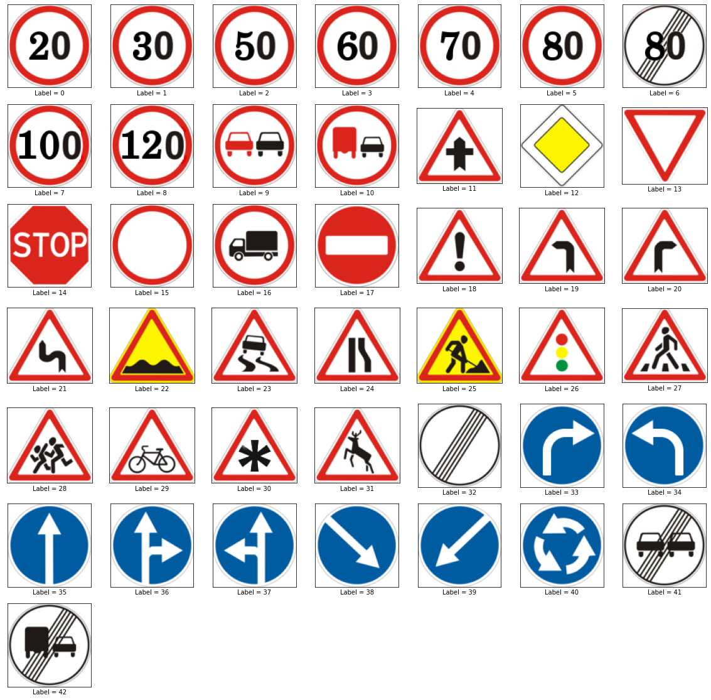
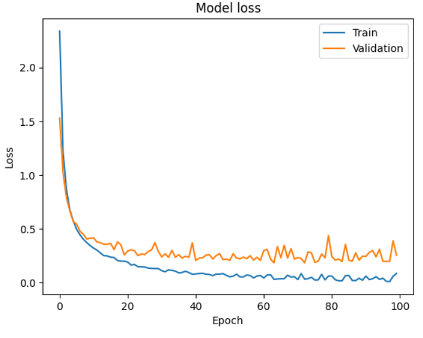
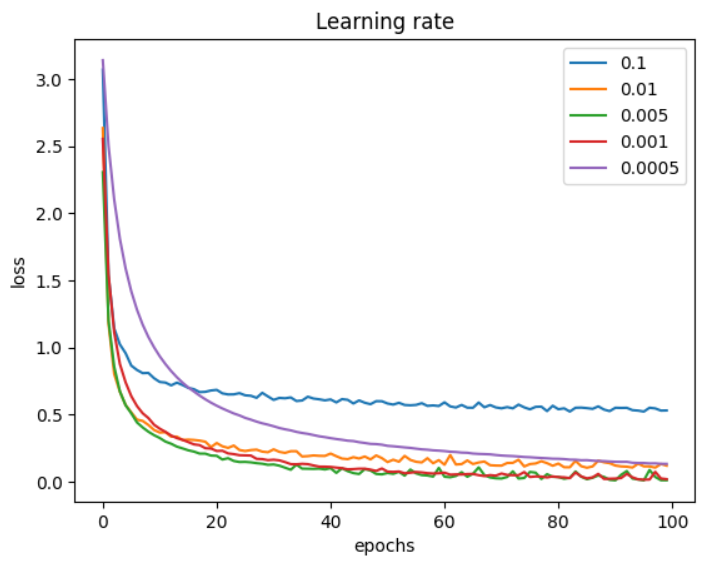

# Abstract 

# Introduction

More and more we see an increased interest in automated vehicle driving both in the manufacturers as well as in common citizens wanting to buy such products. The relevance of this study is ... to find a model that most accurately possibly predicts traffic signs, which will help in autonomous driving.
This project consists of classifying images of traffic signs according to one of these 43 labels shown below.

## Why we chose this project

The world of automation in cars is fascinating to us and it's becoming increasingly evident that a car's software is just as critical as its physical and mechanical components. As a result, it's highly probable that many of us may have the opportunity to work in this field in the future. Computer vision and the ability to recognize patterns on the road are fundamental to an autonomous car and machine learning models are a way to solve this need with pretty good results.
As many more people dedicate themselves to this subject of study, quickly and easier it will be to find a robust and very efficient model which will be able to correctly classify traffic signs. Although our contribution may not be worthy as were are just starting in this field and our knowledge is limited, is it always good to be able to try to perform as well as professionals.

# Data visualization

As said before, we have 43 classes corresponding to a traffic sign. 
We have a folder with 39209 images to train and a folder with 12630 images to test, this makes around 24.36% of the entire dataset to test. 

We have a total of 39209 images to train spread across all 43 classes, however, each class does not have the same amount of samples 

As seen by the graphs above, we have a data imbalance.

We picked 30 random samples from our dataset and it is displayed below in a 6 by 5 grid.

Through this pie graph, we can see the distribution of images per format as their sizes are not the same. Most images are small, up to 40 by 40 pixels but we also have some that are bigger reaching 160 pixels width by 160 pixels height, although this represents a small portion of the dataset. 
This is a problem as machine learning models required the same amount of features across all samples, and in our case, each feature will be a pixel value. The solution is to resize all images to the same size, we chose 30 by 30 pixels as it was the most used proportion and dimensions bigger than that would be too much to handle and require too much time to train.

# Methods

As we can't change data, we need to develop this project in a model-centric view.
(As data are in pixel gradient from 0 to 255 there is no need for normalization.)
Due to class imbalance, accuracy is not a good metric, so we are using F1 score.
We decided to leave convolution neural networks for the next project 

# Models 

Linear Regression does not apply to our case as it is used for regression problems and we have a classification problem at hand.   
Decision trees don't seem to make sense in this exercise as it underlies meaning in features and pixels are a kind of data with little meaning when isolated, also, images have relationships between near pixels and decision trees can't take this into account.
CNN is now the state of the art in this situation as they usually yield higher accuracy.

## Logistic Regression

## Artificial Neural Network

Artificial Neural Networks tries to mimic the learning process of the human brain utilizing most of that math that is behind logistic regression. This imagines layers of neurons that activate according to weights of the previous neurons, the first layer is the input layer and its values never change as this layer contains the features of our dataset, then exists a set of hidden layers that can have an arbitrary number of neurons and it is possible to have 1 or more of this layer, and at last, there is the output layer that assigns a probability to each of the labels. In a Dense Connected Layer each neuron receives all the values from previous neurons multiplied by weights and summed to a bias, then the computed values passes across an activation function and the result is forwarded to the neurons on the next layer. After this process, there is a deviation from the real ground truth an errors but the twiks to ajust the weights are propagated to the previous layers in a process called backprogatation.     
To calculate the error its crucial to have a set of data that wasn't used in the input layer, so we split the original train dataset to have a validation set which allows our NN models to perform cross validation which is a practical and reliable way for testing the predicting power of models.   

There are many possible architectures for this type of models, 1 hidden layer, 2 hidden layers or more and its hard to say *a priori* which parameters will give the best results, so exhaustive experimentation needs to be performed.  

We started by a simple model of only one hidden layer but had to figure out what would be the best number of neurons in that layer. For that we trained the model varying the number of neurons in the hidden layer, from 400 to 1000 with steps of 100.  

 
Through the analysis of this grpah we concluded that the best number of neurons to use in the hidden layer was 800 as it is the value that outputs be best accuracy for the validation process. 

These graphs show the accuracy and loss function along epochs. We clearly see that 

With the same conditions we trained changing the learning rate which is a parameter that controls how fast the loss function aproaches its local minimum. Through this plot we saw that in our case a value of 0.005 is what works best as its aproaches faster a low value of loss function.

## K-nearest Neighbors

This method is very simple and is used in classification problems. It checks the neighbors of a given point in an n-dimension space and by comparing the distances to other points the most *k* near examples vote and the class that has more votes wins.  
This seems a good method but it doesn't learn anything, it does not have the ability to improve itself over time. Its computational time scales linearly $O(N)$ as it has to compare each test sample to every data point in the training set making it inefficient with large datasets. Also, there's no deterministic method to choose the best *k* so a try-and-guess approach is needed.  
This method is good when the number of features is low, however, our case is the opposite, so we expect a low performance using this approach. 
To run this method, all the images are in greyscale and resized to 30x30.

 

   

As we can see from the graph, K-nearest Neighbors doesn't yield good results with any value of *k*, in fact no more than 37% of F1 score was possible to achieve. These results were according to our expectations. 

## SVM

Support Vector Machine (SVM) is a type of supervised learning algorithm that can be used for both classification and regression types of analysis.
The objective of the SVM algorithm is to find a hyperplane in an N-dimensional space (N — the number of features) that distinctly separates the datapoints from each class. The data points which are closest to the hyperplane are called support vectors and are used to determine the margin for the classifier. The goal is to find the optimal hyperplane that maximizes the margin between the two classes.
Sometimes classes are not linearly separable by a hyperplane, so we need to transform the data into a higher dimension space. To solve this it's used the kernel trick. The kernel trick is a method by which we can use a linear classifier to solve a non-linear problem. It transforms the data into another dimension that has a clear dividing margin between classes of data. The kernel trick is used to find a suitable hyperplane in the new dimension.
For binary classification, one hyperplane would be enough to separate the two classes and to predict the class of a new data point. Since we have 43 classes, one unique hyperplane wouldn't be enough to seperate all 43 classes so we used a one-vs-one approach, which means that we train a model for each pair of classes and then we predict the class that has the most wins. For this kind of problem, we have to divide the problem in N(N-1)/2 classifiers, in our case, 903 classifiers were needed.

In our approach to the problem, we started by separating the train dataset into two datasets, one for training and another for validation in a scale of 80%/20%, making sure that both datasets had the same proportion of images in each class in order to avoid some classes being forgotten when training or validating our model. Both of them and the test dataset were resized to 30x30 pixels, converted to grayscale and normalized.

The first step to find the best model was to find out which would be the best kernel, C and gamma values. To do this, we started by using GridSearchCV, which is a method that allows us to find the best parameters for a model by testing all the possible combination of parameters. The problem was that since our dataset was huge and had a lot of features, GridSearchCV was taking too long to run, so what we did was first to create a subset of the train dataset with a small quantity of images (always mantaining the proportion in each class) and then we used GridSearchCV to find the best parameters for that subset. For each combination of parameters we used cross-validation with 5 folds to find the hyperparameters with the best accuracy in the validation dataset.

We got the following results:

As we can see, the best kernel was clearly the RBF kernel, since it was in all of the Top 3 combination of parameters and those had much better validation accuracy. High values of C was also better, also winning by a large validation accuracy margin when comparing to the other values of C. The gamma values were not so clear, but the best values were 0.0001 and 0.001 when using big values for C.
After analysing those results we decided to use the option with the best validation accuracy, which was kernel='rbf', C=100 and gamma=0.0001.

After finding out which was the best combination of hyperparameters, we used those parameters to train a model with the entire train dataset and then we tested it with the entire validation dataset. We got the following results:

As we can see the model was really good as predicting the accuracy in the train dataset, having an accuracy of near 95%. On the other hand, it was not so good at predicting using the validation dataset, having an accuracy of near 80%. This means that the model ended up overfitting the train dataset, which means that it learned too much from the train dataset and ended up not being able to generalize well to new data.
There are several explanation to this like:
- This is a common problem when using SVM, since it's a model that is very sensitive to the hyperparameters and it's very easy to overfit the data.
- The dataset is very big and has a lot of features, so it's very easy to overfit the data, because the model might be learning noise instead of the actual patterns.

Even though the validation loss is not very good, the model still has a good accuracy, when comparing to some other models that we tried.

With the confusion matrix we can see that the model was able to predict most of the classes correctly and that it has a medium accuracy for the most cases.

Another way for better viewing the accuracy of the model, since not all classes have the same ammount of images is to check the accuracy for each class in particularly.

As we can see, the model has different accuracies for each class, but even though some of them are very high, as near as 98%, others ,likes class 0 and 30, have a very low accuracy, below 40%.
This has several explanations like, for example, the class 0 images are very similar to images from other classes since it is as maximum velocity signal and other classes are also maximum velocity signals, in the class 30, some images are very blurry and dark and it's very difficult to see the actual signals, etc.

Overall, the model, when using the real test dataset, ended up having an accuracy of 81%, which is not a bad result, since we are working with a huge dataset and with images that are very similar to each other, but it's also not a very good result, since we were expecting to have a better accuracy.

# Results

# Conclusions

(indicar coisas que poderiam ser melhoradas)

Both students contributed equaly to the elaboration of this project.

# References 

ver esta função do sklearn
gridSearchCV()

https://datascience.stackexchange.com/questions/64289/use-of-decision-trees-for-classifying-images
https://www.sciencedirect.com/science/article/abs/pii/S0893608018300054
https://paperswithcode.com/dataset/gtsrb
