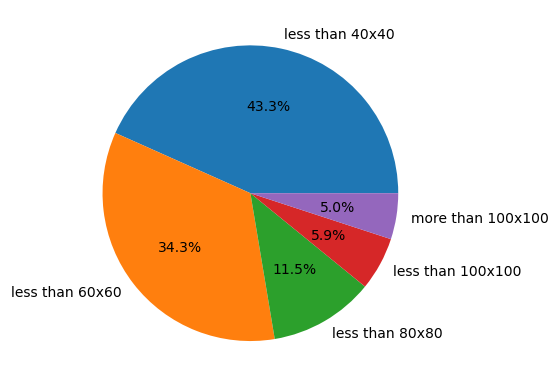

# Abstract 

# Introduction

More and more we see an increased interest in automated vehicle driving both in the manufacturers as well as in common citizens wanting to buy such products. The relevance of this study is ... to find a model that most accurately possibly predicts traffic signs, which will help in autonomous driving.
This project consists of classifying images of traffic signs according to one of these 43 labels shown below.

## Why we chose this project

The world of automation in cars is fascinating to us and it's becoming increasingly evident that a car's software is just as critical as its physical and mechanical components. As a result, it's highly probable that many of us may have the opportunity to work in this field in the future. Computer vision and the ability to recognize patterns on the road are fundamental to an autonomous car and machine learning models are a way to solve this need with pretty good results.
As many more people dedicate themselves to this subject of study, quickly and easier it will be to find a robust and very efficient model which will be able to correctly classify traffic signs. Although our contribution may not be worthy as were are just starting in this field and our knowledge is limited, is it always good to be able to try to perform as well as professionals.

# Data visualization

As said before, we have 43 classes corresponding to a traffic sign. 
We have a folder with 39209 images to train and a folder with 12630 images to test, this makes around 24.36% of the entire dataset to test. 

We have a total of 39209 images to train spread across all 43 classes, however, each class does not have the same amount of samples 

As seen by the graphs above, we have a data imbalance.

We picked 30 random samples from our dataset and it is displayed below in a 6 by 5 grid.

Through this pie graph, we can see the distribution of images per format as their sizes are not the same. Most images are small, up to 40 by 40 pixels but we also have some that are bigger reaching 160 pixels width by 160 pixels height, although this represents a small portion of the dataset. 
This is a problem as machine learning models required the same amount of features across all samples, and in our case, each feature will be a pixel value. The solution is to resize all images to the same size, we chose 30 by 30 pixels as it was the most used proportion and dimensions bigger than that would be too much to handle and require too much time to train.

# Methods

As we can't change data, we need to develop this project in a model-centric view.
(As data are in pixel gradient from 0 to 255 there is no need for normalization.)
Due to class imbalance, accuracy is not a good metric, so we are using F1 score.
We decided to leave convolution neural networks for the next project 

# Models 

Linear Regression does not apply to our case as it is used for regression problems and we have a classification problem at hand.   
Decision trees don't seem to make sense in this exercise as it underlies meaning in features and pixels are a kind of data with little meaning when isolated, also, images have relationships between near pixels and decision trees can't take this into account.
CNN is now the state of the art in this situation as they usually yield higher accuracy.

## Logistic Regression

## Artificial Neural Network

## K-nearest Neighbors

This method is very simple and is used in classification problems. It checks the neighbors of a given point in an n-dimension space and by comparing the distances to other points the most *k* near examples vote and the class that has more votes wins.  
This seems a good method but it doesn't learn anything, it does not have the ability to improve itself over time. Its computational time scales linearly $O(N)$ as it has to compare each test sample to every data point in the training set making it inefficient with large datasets. Also, there's no deterministic method to choose the best *k* so a try-and-guess approach is needed.  
This method is good when the number of features is low, however, our case is the opposite, so we expect a low performance using this approach. 
To run this method, all the images are in greyscale and resized to 30x30.

 

   

As we can see from the graph, K-nearest Neighbors doesn't yield good results with any value of *k*, in fact no more than 37% of F1 score was possible to achieve. These results were according to our expectations. 

## SVM

# Results

# Conclusions

(indicar coisas que poderiam ser melhoradas)

Both students contributed equaly to the elaboration of this project.

# References 

ver esta função do sklearn
gridSearchCV()

https://datascience.stackexchange.com/questions/64289/use-of-decision-trees-for-classifying-images
https://www.sciencedirect.com/science/article/abs/pii/S0893608018300054
https://paperswithcode.com/dataset/gtsrb